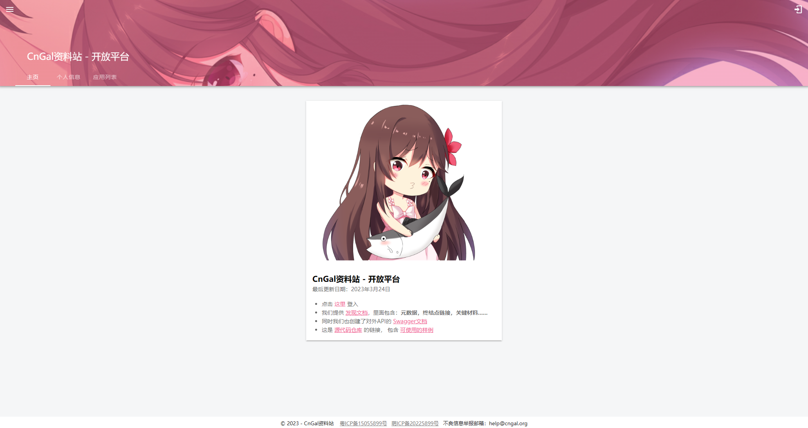
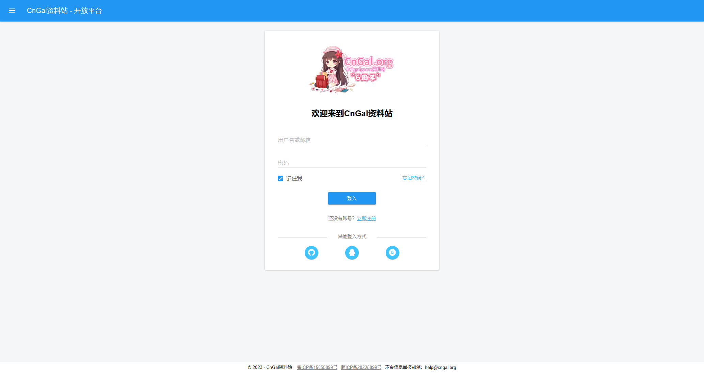
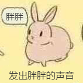
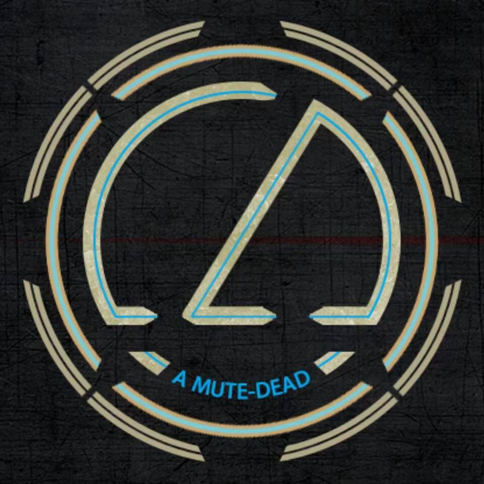
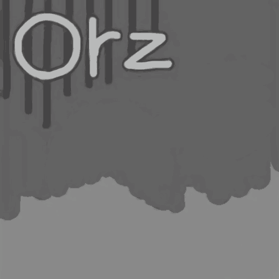
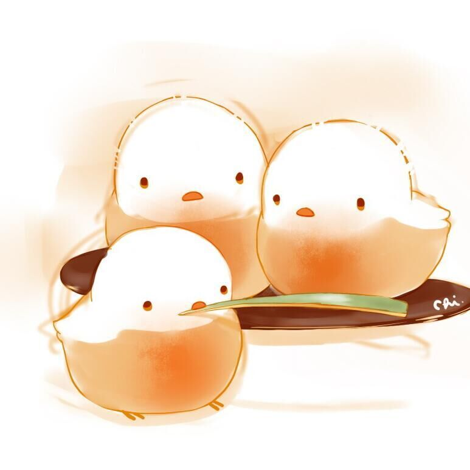

<div align="center">
  <!-- 在此处设置您的项目图标 -->
  

# CnGal 资料站

</div>

<span id="nav-1"></span>

<p align="center"  style="margin-top: 10px;">
<!-- 在这里填写您的项目口标语，最好是一个简短的句子。 -->
    愿每一个CnGal创作者的作品都能不被忘记
</p>
<span id="nav-1"></span>
<div align="center">
 
[](https://github.com/CnGal/CnGalWebSite/LICENSE)
[](https://github.com/misitebao/standard-repository)
[](https://github.com/CnGal/CnGalWebSite)
[](https://afdian.com/@cngal)
[](https://deepwiki.com/CnGal/CnGalWebSite)

</div>

## 国际化

<!-- 这是多语言列表 -->

[简体中文](README.md) | [English](README.en-US.md)

<span id="nav-2"></span>

## 内容目录

<details open="open">
  <summary>点我 打开/关闭 目录列表</summary>

- [CnGal 资料站](#cngal资料站)
  - [国际化](#国际化)
  - [内容目录](#内容目录)
  - [项目介绍](#项目介绍)
    - [官方网站](#官方网站)
    - [背景](#背景)
  - [图形演示](#图形演示)
  - [功能特色](#功能特色)
  - [架构](#架构)
  - [新手入门](#新手入门)
  - [维护者](#维护者)
  - [贡献者](#贡献者)
  - [社区交流](#社区交流)
  - [部分用户](#部分用户)
  - [捐赠者](#捐赠者)
  - [特别感谢](#特别感谢)
  - [版权许可](#版权许可)

</details>

<span id="nav-3"></span>

## 项目介绍

<!-- 在这里填写关于您的项目的详细介绍 -->

这里是 CnGal 资料站第二次改版后的完整网站项目

CnGal 是一个非营利性的，立志于收集整理国内制作组创作及中文化的中文 Galgame/AVG 的介绍、攻略、评测、感想等内容的资料性质的网站。 此外，CnGal 官方还会与圈内中文 AVG 制作组进行友好合作，如免费提供 Banner 广告位，网站服务器资源等。

<span id="nav-3-1"></span>

### 官方网站

主站：https://www.cngal.org/

PWA 应用：https://app.cngal.org/

<!-- 在此填写您项目的官网地址，包括主页、文档等。 -->

<span id="nav-3-2"></span>

### 背景

**时间轴**

2020 年 6 月 6 日 - [《CnGal 制作组大全 V0.1》](https://docs.qq.com/sheet/DRFBsb1pEbUVpUXlj)发布，收录了我们在微博上关注的制作组

2020 年 11 月 13 日 - 开启资料站补全计划，针对角色、游戏周边、相关文章、STAFF 情报制作专门表格，为主站改版做准备

2020 年 12 月 23 日 - 已对 130+款作品情报进行重新整理，占已知 CnGal 游戏总数过 1/3

2021 年 1 月 29 日 - 公开[《CnGal 资料表》](https://docs.qq.com/sheet/DREhYYVdGVmhCa1V2)原始表格，收录 210+款作品

2021 年 8 月 19 日 - CnGal 资料站 v3.0 开始内测

2021 年 9 月 21 日 - 公测开始

2021 年 12 月 16 日 - 正式上线，前端后端所有代码以MIT协议开源

**初心**

『为了让每一个创作者的作品都能不被忘记』

我们开始了为期一年的资料补全<br>
升级站点，让游戏更便于录入<br>
与互联网档案馆对接，让数据永存<br>

『为了让每一个普通的玩家都能参与』

我们采用了类 Wiki 的形式，让每一个玩家都参与编辑<br>
对外开放 API，采用知识共享署名<br>

<!-- 这里填写项目创作背景 -->

<span id="nav-4"></span>

## 图形演示






<!-- 把你项目的demo放在这里，可以是具体的访问地址、图片截图、Gif或者视频等。 -->

<span id="nav-5"></span>

## 功能特色

- 词条
  - 包括二级分类：游戏、制作组、角色、STAFF
  - 拥有主页，相册，标签等模块
  - 游戏包括 STAFF、制作组、发行商
  - 游戏会展示 Steam 贩售价格
  - 角色可以录入身高，性格，瞳色等详细数据
  - 以卡片形式展示关联信息
  - 任何人都可编辑，查看历史编辑数据
  - 允许用户留言
  - 音频预览
- 文章
  - 包括二级分类：攻略、 访谈、感想......
  - 允许用户点赞、评论
  - 任何人都能发布文章，但只有自己能够编辑
- 周边
  - 包括详尽的信息字段：价格，分类，尺寸......
  - 允许关联其他周边，以套装形式展示
  - 会以合集方式展示在相关词条下方
  - 可以记录用户的收集进度
  - 允许用户评论
- 标签
  - 拥有层级关系
- 视频
  - 收录简介、预览图、链接
  - 允许关联其他词条、文章、视频
- 用户
  - 完整的账户管理
  - 允许创建收藏夹，并收藏词条、文章、周边
  - 查看编辑历史
  - 记录积分和贡献值
  - 接收系统消息
  - 允许其他用户在空间留言
  - 绑定第三方账户
- 后台
  - 完善的各模块数据管理页面
  - 批量导入数据
  - 拥有临时脚本执行入口
  - 允许执行定时任务
  - 自动备份页面到互联网档案馆
  - 用户权限管理
- 看板娘
  - 问答
  - 定时任务、随机任务
  - 查询数据
- 投稿工具
  - 合并词条
  - 转载文章
  - 转载视频
- 开放平台
  - 注册应用
  - 提供聚合登入
- 鉴权中心
  - 登入授权
  - 修改账号资料
  - 绑定第三方账号
  - 身份验证
- 其他
  - 数据汇总页面
  - 编辑指引与词条完善度检查
  - 动态汇总页面
  - CV专题页
  <!-- 在此处填写您的项目的功能，通常是一个列表。 -->

<span id="nav-6"></span>

## 架构

### 网站

后端：ASP .Net Core Web API

前端：ASP .Net Core Blazor

UI 库：Masa Blazor, BlazorBootstrap

数据库：Mysql 8.0

ORM：Entity Framework Core 7.0

SDK：.Net 7.0

### 鉴权中心

架构：ASP.NET Core MVC

基于 IdentityServer4 二次开发

### 看板娘

QQ机器人框架使用 [Mirai](https://github.com/mamoe/mirai) 和 [Mirai-API-HTTP](https://github.com/project-mirai/mirai-api-http) 插件
并在 [.Net](https://github.com/microsoft/dotnet) 平台上通过 [MeowMiraiLib](https://github.com/DavidSciMeow/MeowMiraiLib) 第三方库开发

QQ频道使用官方API，在 [.Net](https://github.com/microsoft/dotnet) 平台上通过 [Masuda.Net](https://github.com/ssccinng/Masuda.Net) 第三方库开发

### 文件结构

<!-- 在这里填写你的项目架构图或描述，你可以放置项目目录描述 -->

```
|—— .git                                       Git 配置文件
|—— CnGalWebSite                               项目代码
| |—— CnGalWebSite.APIServer                       主站 - API
| |—— CnGalWebSite.DataModel                       主站 - 数据模型
| |—— CnGalWebSite.DrawingBed                      图床 - API
| |—— CnGalWebSite.Extensions                      公共 - 扩展类库
| |—— CnGalWebSite.HealthCheck                     公共 - 健康检查
| |—— CnGalWebSite.Helper                          公共 - 工具类库
| |—— CnGalWebSite.HistoryData                     资料表处理脚本（已弃用）
| |—— CnGalWebSite.IdentityServer                  鉴权中心
| |—— CnGalWebSite.IdentityServer.Admin.Shared     开放平台 - 共享组件
| |—— CnGalWebSite.IdentityServer.Admin.SSR        开放平台 - SSR
| |—— CnGalWebSite.IdentityServer.Admin.WASM       开放平台 - WASM
| |—— CnGalWebSite.IdentityServer.Models           鉴权中心 - 数据模型
| |—— CnGalWebSite.Maui                            MAUI
| |—— CnGalWebSite.PostTools                       投稿工具（已弃用）
| |—— CnGalWebSite.PublicToolbox                   投稿工具
| |—— CnGalWebSite.RobotClient                     看板娘
| |—— CnGalWebSite.Server                          主站 - SSR
| |—— CnGalWebSite.Shared                          主站 - 共享组件
| |—— CnGalWebSite.WebAssembly                     主站 - WASM
|—— CHANGELOG.md                              发布日志
|—— LICENSE                                   许可证
|—— README.md                                 中文 README
|—— README.en-US.md                           英语 README

```

<span id="nav-7"></span>

## 新手入门

<!-- 在这里写下项目的详细说明，告诉用户如何使用你的项目。 -->

如果你想要开发第三方客户端，请参阅 [API 使用流程](/Docs/AboutCode/APIInstructions/Summary.md)

[点我](/Docs/AboutCode/BasicTutorial/HowToRun.md) 查看如何搭建运行环境并运行项目

或者查看 [看板娘的自我介绍](/Docs/Kanban/Summary.md)

在参与项目之前，可以查看 [代码文档](/Docs/AboutCode/Summary.md) 了解代码结构，并阅读我们的 [代码规范]()

<span id="nav-8"></span>

## 维护者

感谢这些项目的维护者：

<!-- 这里填写项目作者的相关信息 -->

<a href="https://github.com/LittleFish-233"></a>

<details>
  <summary>点我 打开/关闭 维护者列表</summary>

- [沙雕の方块](https://github.com/LittleFish-233) - 项目开发者，大三，努力成为全栈工程师中

</details>

<span id="nav-9"></span>

## 贡献者

感谢所有参与 CnGal 资料站 开发的贡献者。[贡献者列表](https://github.com/CnGal/CnGalWebSite/graphs/contributors)

<!-- 这里填写项目贡献者列表，通常是列表，当然也可以用图片代替。 -->

<span id="nav-10"></span>

## 社区交流

CnGal 玩家交流群：[948774838](https://qm.qq.com/q/bgKC6yy5ri)

CnGal 资料站编辑者交流&Bug 反馈群：[761794704](https://jq.qq.com/?_wv=1027&k=JzuI1IkF)

新浪微博：[CnGal](https://weibo.com/cngalorg)

<!-- 此处填写项目的线上线下交流地址，可以是即时通讯群、社区、讨论群等。 -->

<span id="nav-11"></span>

## 部分用户

CnGal 资料站：https://www.cngal.org/

<!-- 在此处填写项目的用户列表，并告诉访问者哪些用户正在使用您的项目。 -->

<span id="nav-12"></span>

## 捐赠者

感谢这些项目的捐赠者：

[捐赠者名单](Donation_List.md)
<!-- 在这里填写捐赠者名单 -->

<!-- ## 赞助商

在这里填写赞助商名单

<span id="nav-14"></span> -->

## 特别感谢

感谢不愿透露姓名的热心人士提供词库

感谢 KSE Hiyo 为资料站制作宣传 PV


感谢参与编辑[《CnGal 制作组大全 V0.1》](https://docs.qq.com/sheet/DRFBsb1pEbUVpUXlj)的胖胖、小恸恸、HAna

  

感谢半年以来参与资料站补全计划，一同编辑资料表和提供参考资料的小伙伴们：

                        

九州人士，Sliots，亲王，声控灯，隐，捡垃圾的垃圾佬，CriAngel，沙雕の方块，昊晨，我不姓高 abc，百变一点也不怪，柳知萧，磁爆步兵杨永信，月骨 ✾ۖ͡ 琉璃 ೄ೨，zhl，原味葱油饼干，Chr\_，Pink Paul，快乐的老鼠宝宝，七海无涯，深盾亲王欧根，Grayson Kun，祢梨，ええと，绫光

<!-- 在这里填写特别感谢名单，可以是任何人或事物。 -->

<span id="nav-15"></span>

## 版权许可

[License MIT](LICENSE)
